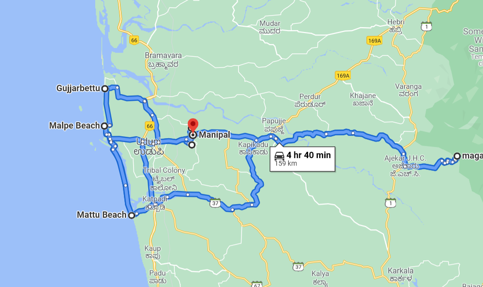

```{r setup, include=FALSE}
knitr::opts_chunk$set(echo = TRUE)
```

# Itinerary

## Mon, 27 Dec (sunrise 06:41, sunset 18:03)

\begin{tabbing}

\textbf{06:15} \= \textbf{Deboard bus in Manipal} \\
\> Walk to \href{https://ebird.org/hotspot/L3825136}{End Point hotspot} (2.7 km, <30 min) \\
            
\textbf{06:45} \> \textbf{End Point} \\
\> Walk around for 2 h. 40-50 species possible. Herga and Shettybettu for later.\\
\> RuWo, babblers (RuBa, DFBa, ISBa), thrushes (OHTh), GrJu, starlings (MaSt), bulbuls (FTBu), \\
\> MPHo, AFBl  \\

\textbf{08:45} \> \textbf{Start walking to ZoomCar pickup (Country Inn)} \\

\textbf{09:00} \> \textbf{Arrive at ZoomCar pickup} \\
\> Also find light and quick \textbf{breakfast} around. \\

\textbf{10:00} \> \textbf{Depart in ZoomCar} \\

\textbf{10:15} \> \textbf{Manipal Lake} \href{https://goo.gl/maps/To2SRLrgnXCJz9Dk7}{(Map)} \\
\> Try to finish in 1 h. Around 30-35 species. Main tick: Tufted Duck.\\

\textbf{11:15} \> \textbf{Leave for Gujjarbettu paddyfields} \\

\textbf{11:45} \> \textbf{Gujjarbettu paddyfields} \href{https://goo.gl/maps/SqK2bzJJPykT6QUf7}{(Map)} \href{https://ebird.org/hotspot/L7968837}{(Hotspot)} \\
\> Spend 30 mins scanning for interesting birds. Waders, raptors, hornbill, munias, etc. \\
\> Then move to Malpe. \\

\textbf{12:30} \> \textbf{Malpe port} \href{https://goo.gl/maps/qaBaiqRae27HwV7t9}{(Map)} \href{https://ebird.org/hotspot/L3083243}{(Hotspot)} \\
\> Walk along beach, watch rocks for congregations of terns and waders. \\
\> Around 20-25 species. Jaeger, gulls, terns, WRHe, StHe, WBSE, frigatebirds(?). \\
\> Spend around one hour here, then move for lunch. \\

\textbf{13:30} \> \textbf{Lunch (max. 45 mins) from Malpe} \\

\textbf{14:15} \> \textbf{Malpe sandbar} \\
\> Move south along sandbar, possible stops at multiple locations. Look out for interesting \\
\> flocks. Move south till Mattu Beach area, possible quick stop there. \\

\textbf{17:00} \> \textbf{Start for Andar} \\
\> 50 km, roughly 1.5 h w/o stops. Possible stop for sunset en route. Maybe find dinner too. \\

\textbf{20:00} \> \textbf{Arrive at accommodation} \href{https://maps.app.goo.gl/Bxkyf88SBwimdbhw7}{(Map)} \\
\> If no dinner yet, find around. Night walk around 2 h.  \\

\textbf{23:00} \> \textbf{Sleep} \\


\end{tabbing}


## Tue, 28 Dec (sunrise 06:41, sunset 18:03)

\begin{tabbing}


\textbf{05:00} \= \textbf{Wake up!} \\
\> Freshen up quick and possibly stop for chai. Ready to leave by 05:30 or 05:45. \\

\textbf{06:00} \> \textbf{Short birding around farm} \\
\> Can try for thrushes and babblers. Maybe some fancy warblers/flycatchers. \\
\> Possible: MaBa, MGHo, LiSp, GFGP, YFGP, MIPi, HSWo, SpPi, BEKi, Malabar Trogon! \\

\textbf{07:00} \> \textbf{Leave for Mattu beach} \\
\> Possible stops en route, like Murathagudde \href{https://goo.gl/maps/EYVvhB99zEDnh5XX7}{viewpoint}. \\
\> \textbf{Breakfast} on the way. \\

\textbf{09:30} \> \textbf{Mattu beach to Malpe beach} \\
\> Relaxed but focussed birding along beach/sandbar for pelagic and shorebirds.  \\
\> Multiple stops and \textbf{lunch} en route. \\

\textbf{14:00} \> \textbf{Leave for Manipal} \\

\textbf{14:30} \> \textbf{Drop off car} \\
\> And walk 3-4 km from dropoff to Herga.  \\

\textbf{15:00} \> \textbf{Herga, Shettybettu} \\
\> May not be possible to explore all places (\href{https://ebird.org/hotspot/L3333753}{Herga}, \href{https://ebird.org/hotspot/L3272868}{Shettybettu}, \href{https://ebird.org/hotspot/L2611821}{Saralebettu}) fully. \\
\> Common Grasshopper-Warbler seen in 2017--18 winter on \href{https://goo.gl/maps/oX74rorsgJDhkbD68}{Herga Temple Road} \\

\textbf{19:00} \> \textbf{Walk to Manipal and dinner} \\
\> And relax till bus! \\

\textbf{20:45} \> \textbf{Board bus!} \\


\end{tabbing}


# Approximate car travel

Total will be around 160 km, which is the free allowance, plus or minus a few. 

  


# Extra attention for:

1. Shorebirds!!! 
1. Dark-fronted Babbler (End Point, anywhere)
1. Tufted Duck (Manipal Lake)
1. Nilgiri Wood-Pigeon (End Point, any forest area)
1. Malabar Pied Hornbill (End Point, any forest area)
1. Malabar Trogon (closer to Ghats, so near Karkala, farm)
1. Common, Blyth's, Alpine Swifts (anywhere, sky)
1. Nilgiri and Thick-billed vs. Pale-billed Flowerpecker
1. Small, Ashy and Orange Minivets
1. Coppersmith vs. Malabar Barbet
1. Sri Lankan Frogmouth (End Point, Herga, farm, anywhere!)
1. Owls (farm, night walk)


# General study material

[Ashwin's trip report 1](https://ebird.org/india/tripreport/2044?forceLogin=true)

[Ashwin's trip report 2](https://ebird.org/india/tripreport/1570?forceLogin=true)

[Ashwin's trip report 3](https://ebird.org/india/tripreport/1609?forceLogin=true)

[Ashwin's trip report 4](https://ebird.org/india/tripreport/1972?forceLogin=true)